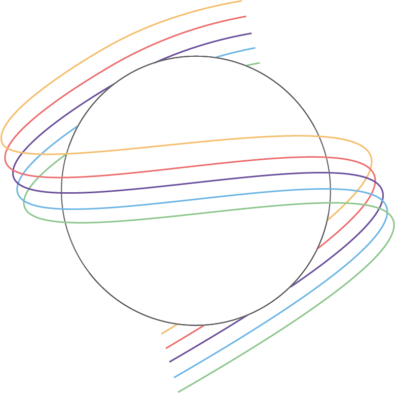

<!--
*** Thanks for checking out the Best-README-Template. If you have a suggestion
*** that would make this better, please fork the repo and create a pull request
*** or simply open an issue with the tag "enhancement".
*** Thanks again! Now go create something AMAZING! :D
***
***
***
*** To avoid retyping too much info. Do a search and replace for the following:
*** github_username, repo_name, twitter_handle, email, project_title, project_description
-->


<!-- PROJECT SHIELDS -->
<!--
*** I'm using markdown "reference style" links for readability.
*** Reference links are enclosed in brackets [ ] instead of parentheses ( ).
*** See the bottom of this document for the declaration of the reference variables
*** for contributors-url, forks-url, etc. This is an optional, concise syntax you may use.
*** https://www.markdownguide.org/basic-syntax/#reference-style-links
-->
[![Contributors][contributors-shield]][contributors-url]
[![Forks][forks-shield]][forks-url]
[![Stargazers][stars-shield]][stars-url]
[![Issues][issues-shield]][issues-url]


<!-- PROJECT LOGO -->
<br />
<p align="center">
  <a href="https://github.com/aylincin/seth">
    
  </a>

  <h3 align="center">SETH</h3>

  <p align="center">
    Straight Emotion To Heart
    <br />
    <a href="https://github.com/aylincin/seth"><strong>Explore the docs »</strong></a>
    <br />
    <br />
    <a href="https://www.youtube.com/watch?v=fwbWFBLgVIw">View Demo</a>
    ·
    <a href="https://github.com/aylincin/seth/issues">Report Bug</a>
    ·
    <a href="https://github.com/aylincin/seth/issues">Request Feature</a>
  </p>
</p>


<!-- TABLE OF CONTENTS -->
<details open="open">
  <summary><h2 style="display: inline-block">Table of Contents</h2></summary>
  <ol>
    <li>
      <a href="#about-the-project">About The Project</a>
      <ul>
        <li><a href="#built-with">Built With</a></li>
      </ul>
    </li>
    <li>
      <a href="#getting-started">Getting Started</a>
      <ul>
        <li><a href="#prerequisites">Prerequisites</a></li>
        <li><a href="#installation">Installation</a></li>
      </ul>
    </li>
    <li><a href="#usage">Usage</a></li>
    <li><a href="#roadmap">Roadmap</a></li>
    <li><a href="#contributing">Contributing</a></li>
    <!-- <li><a href="#license">License</a></li> -->
    <li><a href="#contact">Contact</a></li>
    <!-- <li><a href="#acknowledgements">Acknowledgements</a></li> -->
  </ol>
</details>


<!-- ABOUT THE PROJECT -->
## About The Project

In the prototype Seth, a system was developed to exchange emotions over distances. In the system, there are two spheres. One of them is small and is responsible for the input of the emotion. The second sphere, which is larger and has a frame, displays the sent emotions. In order to be able to send emotions, the small sphere must be held at a certain point on the frame of the larger sphere, so that the feeling of closeness is conveyed and the sending of data can begin. Then, live data is sent to the receiver's output sphere, which uses motors to move the large sphere and display the same motion as the input sphere. This allows the sender to intuitively and individually express their emotions while the receiver can perceive them.

<!-- [![Product Name Screen Shot][product-screenshot]](https://example.com) -->

<!-- Here's a blank template to get started:
**To avoid retyping too much info. Do a search and replace with your text editor for the following:**
`github_username`, `repo_name`, `twitter_handle`, `email`, `project_title`, `project_description` -->


<!-- ### Built With

* []()
* []()
* []() -->


<!-- GETTING STARTED -->
## Getting Started

To get a local copy up and running follow these simple steps.

### Prerequisites

No Prerequisites needed.

### Installation

1. Clone the repo
   ```sh
   git clone https://github.com/aylincin/seth.git
   ```
2. Install Arduino
3. Install Arduino Libraries
   * Stepper.h
   * ESP8266WiFi.h
   * ESP8266WebServer.h
   * Adafruit_NeoPixel.h
   * ESP8266WiFi.h
   * Adafruit_NeoPixel.h
   * Adafruit_MPU6050.h
   * Adafruit_Sensor.h


<!-- USAGE EXAMPLES -->
## Usage

Upload the empafenger/empfaenger.ino script to the Arduino of the output device and the sender/sender.ino script to the input device.


<!-- ROADMAP -->
## Roadmap

See the [open issues](https://github.com/aylincin/seth/issues) for a list of proposed features (and known issues).


<!-- CONTRIBUTING -->
## Contributing

Contributions are what make the open source community such an amazing place to be learn, inspire, and create. Any contributions you make are **greatly appreciated**.

1. Fork the Project
2. Create your Feature Branch (`git checkout -b feature/AmazingFeature`)
3. Commit your Changes (`git commit -m 'Add some AmazingFeature'`)
4. Push to the Branch (`git push origin feature/AmazingFeature`)
5. Open a Pull Request


<!-- LICENSE -->
<!-- ## License

Distributed under the MIT License. See `LICENSE` for more information. -->


<!-- CONTACT -->
## Contact

<!-- Your Name - [@twitter_handle](https://twitter.com/twitter_handle) - email -->

Project Link: [https://github.com/aylincin/seth](https://github.com/aylincin/seth)


<!-- ACKNOWLEDGEMENTS -->
<!-- ## Acknowledgements

* []()
* []()
* []() -->


<!-- MARKDOWN LINKS & IMAGES -->
<!-- https://www.markdownguide.org/basic-syntax/#reference-style-links -->
[contributors-shield]: https://img.shields.io/github/contributors/aylincin/seth.svg?style=for-the-badge
[contributors-url]: https://github.com/aylincin/seth/graphs/contributors
[forks-shield]: https://img.shields.io/github/forks/aylincin/seth.svg?style=for-the-badge
[forks-url]: https://github.com/aylincin/seth/network/members
[stars-shield]: https://img.shields.io/github/stars/aylincin/seth.svg?style=for-the-badge
[stars-url]: https://github.com/aylincin/seth/stargazers
[issues-shield]: https://img.shields.io/github/issues/aylincin/seth.svg?style=for-the-badge
[issues-url]: https://github.com/aylincin/seth/issues
